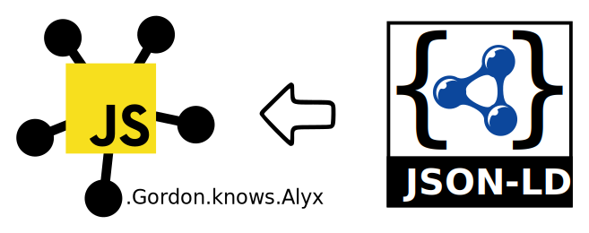

Using JSON-LD with (but not limited to) GraphQL.

The function `jsonld2obj` constructs an object graph in memory by resolving the `@id` properties recursively.
The graph can contain cycles.

# TL;DR
```js
const data = ... get JSON-LD data from somewhere ...
const {jsonld2obj, autoSimplifier, mutateGraphKeys} = require("graphql-jsonld-utils")
const graph = await jsonld2obj(data)
mutateGraphKeys(autoSimplifier)(graph)

graph.Gordon.knows.Alyx.name // -> "Alyx Vence"
graph.Gordon.knows.Alyx.knows.name // -> "Gordon Freeman"
```


# Add dependency to your project
```console
$ yarn add https://github.com/vsimko/graphql-jsonld-utils.git
```

# Example
```js
const {jsonld2obj} = require("graphql-jsonld-utils")
const data = [
  {
    "@context": {
      "@base": "http://halflife/",
      "@vocab": "http://schema.org/",
      "knows": {
        "@type" :"@id"
      }
    },
    "@id": "Gordon",
    "@type": "Person",
    "gender": "male",
    "name": "Gordon Freeman",
    "knows": [
      {
        "@id": "Alyx",
        "@type": ["Person", "Hacker"],
        "gender": "female",
        "name": "Alyx Vence",
        "knows": "Gordon",
        "owns": "Pistol",
      },
      "Barney"
    ],
    "owns": ["Gravity Gun", "Crowbar"]
  }
]

const graph = await jsonld2obj(data)
console.log(graph)
```

Generates the following output:
```
{ 'http://halflife/Gordon':
   { 'http://halflife/Gordon': [Circular],
   ...
   ...
}
```

Now it is possible to navigate the graph as follows:
```js
graph
  ["http://halflife/Alyx"]
  ["http://schema.org/knows"]
  ["http://schema.org/name"] // -> "Gordon Freeman"

graph
  ["http://halflife/Alyx"]
  ["http://schema.org/knows"]
  ["http://halflife/Gordon"]
  ["http://schema.org/name"] // -> "Gordon Freeman"
```

## Shorteninig of property names

Of course, we don't like these huge identifiers in our code.
To shorten the property names, such as `http://schema.org/knows` to `knows`, we can use the following function:
```js
const {autoSimplifier, mutateGraphKeys} = require("graphql-jsonld-utils")
mutateGraphKeys(autoSimplifier)(graph) // mutates the graph in-place
```

Now it is possible to navigate the graph as follows:
```js
graph.Gordon.knows.Alyx.name // -> "Alyx Vence"
graph.Gordon.knows.Alyx.knows.name // -> "Gordon Freeman"
```

The function `mutateGraphKeys` is not pure, it mutates the keys in the original graph.
During this process, an exception is thrown if an ambigous replacement has occured.

## Other replacement functions

- `dropPrefix` : removes prefix from each key
- `dropNsPrefix` : removes namespace prefix, e.g. `schema:`
- `toUnderscores` : replaces special characters to `_` to make navigation in javascript easier
- `afterLastSlash` : keeps the word after the last slash e.g. `http://schema.org/known` to `knows`
- `afterLastHash` : e.g. `http://something#abc` to `abc`
- `autoSimplifier` : combines multiple operations

## Replacements in a functional way

With ramda (or sanctuary) we can compose the replacements in a functional way as follows:
```js
const {compose, replace} = require("ramda")
const replacers = compose(
  dropNsPrefix("foaf"),
  dropNsPrefix("schema"),
  replace(/...regex.../, "..."), // custom regex replacement
  /* ... */
)
```

## Types resolved automagically

If your JSON-LD data contains the `@type` property, our function automatically resolves it into a javascript object and makes it accessible through `$type` property (for easier navigation in javascript)

```js
graph.Gordon.$type // -> Multival(Person)
graph.Alyx.$type // -> Multival(Person, Hacker)
```
